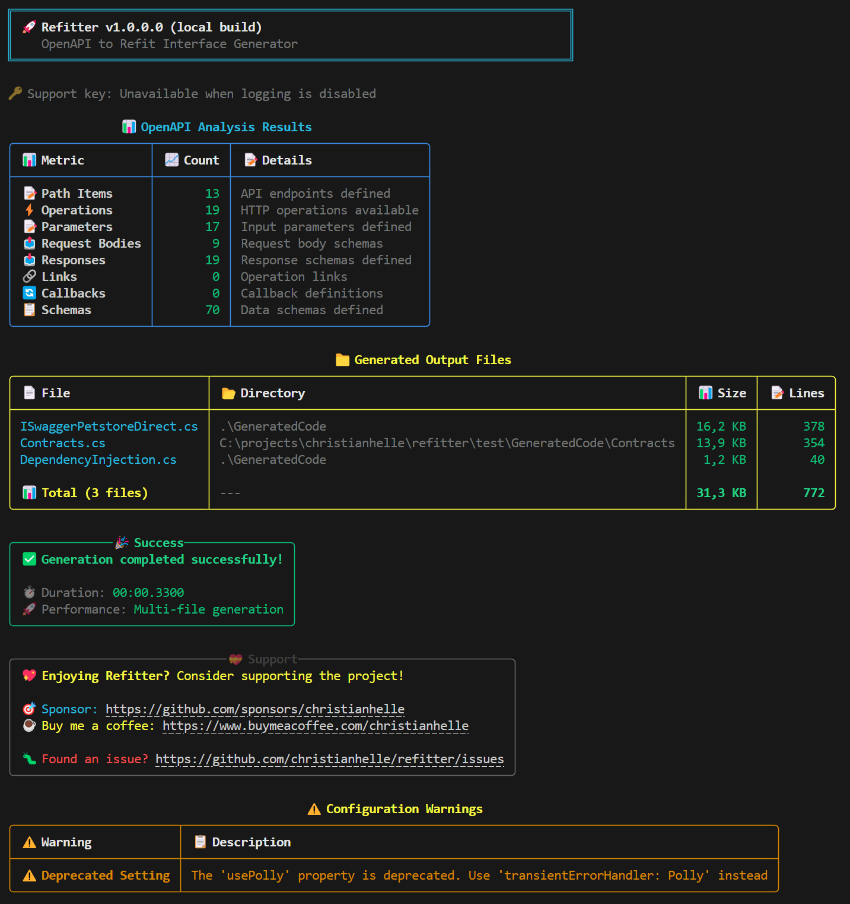

## Examples

Here's an example generated output from the [Swagger Petstore example](https://petstore3.swagger.io) using the default settings

**CLI Tool**

```bash
$ refitter ./openapi.json --namespace "Your.Namespace.Of.Choice.GeneratedCode"
```

**Console Output**



**Source Generator ***.refitter*** file**

```json
{
  "openApiPath": "./openapi.json",
  "namespace": "Your.Namespace.Of.Choice.GeneratedCode"
}
```

**Output**

```cs
using Refit;
using System.Collections.Generic;
using System.Text.Json.Serialization;
using System.Threading.Tasks;

namespace Your.Namespace.Of.Choice.GeneratedCode
{
    [System.CodeDom.Compiler.GeneratedCode("Refitter", "1.0.0.0")]
    public partial interface ISwaggerPetstore
    {
        /// <summary>Update an existing pet</summary>
        /// <remarks>Update an existing pet by Id</remarks>
        /// <param name="body">Update an existent pet in the store</param>
        /// <returns>Successful operation</returns>
        /// <exception cref="ApiException">
        /// Thrown when the request returns a non-success status code:
        /// <list type="table">
        /// <listheader>
        /// <term>Status</term>
        /// <description>Description</description>
        /// </listheader>
        /// <item>
        /// <term>400</term>
        /// <description>Invalid ID supplied</description>
        /// </item>
        /// <item>
        /// <term>404</term>
        /// <description>Pet not found</description>
        /// </item>
        /// <item>
        /// <term>405</term>
        /// <description>Validation exception</description>
        /// </item>
        /// </list>
        /// </exception>
        [Headers("Accept: application/xml, application/json")]
        [Put("/pet")]
        Task<Pet> UpdatePet([Body] Pet body);

        /// <summary>Add a new pet to the store</summary>
        /// <remarks>Add a new pet to the store</remarks>
        /// <param name="body">Create a new pet in the store</param>
        /// <returns>Successful operation</returns>
        /// <exception cref="ApiException">
        /// Thrown when the request returns a non-success status code:
        /// <list type="table">
        /// <listheader>
        /// <term>Status</term>
        /// <description>Description</description>
        /// </listheader>
        /// <item>
        /// <term>405</term>
        /// <description>Invalid input</description>
        /// </item>
        /// </list>
        /// </exception>
        [Headers("Accept: application/xml, application/json")]
        [Post("/pet")]
        Task<Pet> AddPet([Body] Pet body);

        /// <summary>Finds Pets by status</summary>
        /// <remarks>Multiple status values can be provided with comma separated strings</remarks>
        /// <param name="status">Status values that need to be considered for filter</param>
        /// <returns>successful operation</returns>
        /// <exception cref="ApiException">
        /// Thrown when the request returns a non-success status code:
        /// <list type="table">
        /// <listheader>
        /// <term>Status</term>
        /// <description>Description</description>
        /// </listheader>
        /// <item>
        /// <term>400</term>
        /// <description>Invalid status value</description>
        /// </item>
        /// </list>
        /// </exception>
        [Headers("Accept: application/json")]
        [Get("/pet/findByStatus")]
        Task<ICollection<Pet>> FindPetsByStatus([Query] Status? status);

        /// <summary>Finds Pets by tags</summary>
        /// <remarks>Multiple tags can be provided with comma separated strings. Use tag1, tag2, tag3 for testing.</remarks>
        /// <param name="tags">Tags to filter by</param>
        /// <returns>successful operation</returns>
        /// <exception cref="ApiException">
        /// Thrown when the request returns a non-success status code:
        /// <list type="table">
        /// <listheader>
        /// <term>Status</term>
        /// <description>Description</description>
        /// </listheader>
        /// <item>
        /// <term>400</term>
        /// <description>Invalid tag value</description>
        /// </item>
        /// </list>
        /// </exception>
        [Headers("Accept: application/json")]
        [Get("/pet/findByTags")]
        Task<ICollection<Pet>> FindPetsByTags([Query(CollectionFormat.Multi)] IEnumerable<string> tags);

        /// <summary>Find pet by ID</summary>
        /// <remarks>Returns a single pet</remarks>
        /// <param name="petId">ID of pet to return</param>
        /// <returns>successful operation</returns>
        /// <exception cref="ApiException">
        /// Thrown when the request returns a non-success status code:
        /// <list type="table">
        /// <listheader>
        /// <term>Status</term>
        /// <description>Description</description>
        /// </listheader>
        /// <item>
        /// <term>400</term>
        /// <description>Invalid ID supplied</description>
        /// </item>
        /// <item>
        /// <term>404</term>
        /// <description>Pet not found</description>
        /// </item>
        /// </list>
        /// </exception>
        [Headers("Accept: application/xml, application/json")]
        [Get("/pet/{petId}")]
        Task<Pet> GetPetById(long petId);

        /// <summary>Updates a pet in the store with form data</summary>
        /// <param name="petId">ID of pet that needs to be updated</param>
        /// <param name="name">Name of pet that needs to be updated</param>
        /// <param name="status">Status of pet that needs to be updated</param>
        /// <returns>A <see cref="Task"/> that completes when the request is finished.</returns>
        /// <exception cref="ApiException">
        /// Thrown when the request returns a non-success status code:
        /// <list type="table">
        /// <listheader>
        /// <term>Status</term>
        /// <description>Description</description>
        /// </listheader>
        /// <item>
        /// <term>405</term>
        /// <description>Invalid input</description>
        /// </item>
        /// </list>
        /// </exception>
        [Post("/pet/{petId}")]
        Task UpdatePetWithForm(long petId, [Query] string name, [Query] string status);

        /// <summary>Deletes a pet</summary>
        /// <param name="petId">Pet id to delete</param>
        /// <returns>A <see cref="Task"/> that completes when the request is finished.</returns>
        /// <exception cref="ApiException">
        /// Thrown when the request returns a non-success status code:
        /// <list type="table">
        /// <listheader>
        /// <term>Status</term>
        /// <description>Description</description>
        /// </listheader>
        /// <item>
        /// <term>400</term>
        /// <description>Invalid pet value</description>
        /// </item>
        /// </list>
        /// </exception>
        [Delete("/pet/{petId}")]
        Task DeletePet(long petId, [Header("api_key")] string api_key);

        /// <summary>uploads an image</summary>
        /// <param name="petId">ID of pet to update</param>
        /// <param name="additionalMetadata">Additional Metadata</param>
        /// <returns>
        /// A <see cref="Task"/> representing the <see cref="IApiResponse"/> instance containing the result:
        /// <list type="table">
        /// <listheader>
        /// <term>Status</term>
        /// <description>Description</description>
        /// </listheader>
        /// <item>
        /// <term>200</term>
        /// <description>successful operation</description>
        /// </item>
        /// </list>
        /// </returns>
        [Headers("Accept: application/json")]
        [Post("/pet/{petId}/uploadImage")]
        Task<ApiResponse> UploadFile(long petId, [Query] string additionalMetadata,  StreamPart body);

        /// <summary>Returns pet inventories by status</summary>
        /// <remarks>Returns a map of status codes to quantities</remarks>
        /// <returns>successful operation</returns>
        /// <exception cref="ApiException">Thrown when the request returns a non-success status code.</exception>
        [Headers("Accept: application/json")]
        [Get("/store/inventory")]
        Task<IDictionary<string, int>> GetInventory();

        /// <summary>Place an order for a pet</summary>
        /// <remarks>Place a new order in the store</remarks>
        /// <returns>successful operation</returns>
        /// <exception cref="ApiException">
        /// Thrown when the request returns a non-success status code:
        /// <list type="table">
        /// <listheader>
        /// <term>Status</term>
        /// <description>Description</description>
        /// </listheader>
        /// <item>
        /// <term>405</term>
        /// <description>Invalid input</description>
        /// </item>
        /// </list>
        /// </exception>
        [Headers("Accept: application/json")]
        [Post("/store/order")]
        Task<Order> PlaceOrder([Body] Order body);

        /// <summary>Find purchase order by ID</summary>
        /// <remarks>For valid response try integer IDs with value <= 5 or > 10. Other values will generated exceptions</remarks>
        /// <param name="orderId">ID of order that needs to be fetched</param>
        /// <returns>successful operation</returns>
        /// <exception cref="ApiException">
        /// Thrown when the request returns a non-success status code:
        /// <list type="table">
        /// <listheader>
        /// <term>Status</term>
        /// <description>Description</description>
        /// </listheader>
        /// <item>
        /// <term>400</term>
        /// <description>Invalid ID supplied</description>
        /// </item>
        /// <item>
        /// <term>404</term>
        /// <description>Order not found</description>
        /// </item>
        /// </list>
        /// </exception>
        [Headers("Accept: application/json")]
        [Get("/store/order/{orderId}")]
        Task<Order> GetOrderById(long orderId);

        /// <summary>Delete purchase order by ID</summary>
        /// <remarks>For valid response try integer IDs with value < 1000. Anything above 1000 or nonintegers will generate API errors</remarks>
        /// <param name="orderId">ID of the order that needs to be deleted</param>
        /// <returns>A <see cref="Task"/> that completes when the request is finished.</returns>
        /// <exception cref="ApiException">
        /// Thrown when the request returns a non-success status code:
        /// <list type="table">
        /// <listheader>
        /// <term>Status</term>
        /// <description>Description</description>
        /// </listheader>
        /// <item>
        /// <term>400</term>
        /// <description>Invalid ID supplied</description>
        /// </item>
        /// <item>
        /// <term>404</term>
        /// <description>Order not found</description>
        /// </item>
        /// </list>
        /// </exception>
        [Delete("/store/order/{orderId}")]
        Task DeleteOrder(long orderId);

        /// <summary>Create user</summary>
        /// <remarks>This can only be done by the logged in user.</remarks>
        /// <param name="body">Created user object</param>
        /// <returns>successful operation</returns>
        /// <exception cref="ApiException">Thrown when the request returns a non-success status code.</exception>
        [Headers("Accept: application/json, application/xml")]
        [Post("/user")]
        Task CreateUser([Body] User body);

        /// <summary>Creates list of users with given input array</summary>
        /// <remarks>Creates list of users with given input array</remarks>
        /// <returns>Successful operation</returns>
        /// <exception cref="ApiException">Thrown when the request returns a non-success status code.</exception>
        [Headers("Accept: application/xml, application/json")]
        [Post("/user/createWithList")]
        Task<User> CreateUsersWithListInput([Body] IEnumerable<User> body);

        /// <summary>Logs user into the system</summary>
        /// <param name="username">The user name for login</param>
        /// <param name="password">The password for login in clear text</param>
        /// <returns>successful operation</returns>
        /// <exception cref="ApiException">
        /// Thrown when the request returns a non-success status code:
        /// <list type="table">
        /// <listheader>
        /// <term>Status</term>
        /// <description>Description</description>
        /// </listheader>
        /// <item>
        /// <term>400</term>
        /// <description>Invalid username/password supplied</description>
        /// </item>
        /// </list>
        /// </exception>
        [Headers("Accept: application/json")]
        [Get("/user/login")]
        Task<string> LoginUser([Query] string username, [Query] string password);

        /// <summary>Logs out current logged in user session</summary>
        /// <returns>A <see cref="Task"/> that completes when the request is finished.</returns>
        /// <exception cref="ApiException">Thrown when the request returns a non-success status code.</exception>
        [Get("/user/logout")]
        Task LogoutUser();

        /// <summary>Get user by user name</summary>
        /// <param name="username">The name that needs to be fetched. Use user1 for testing.</param>
        /// <returns>successful operation</returns>
        /// <exception cref="ApiException">
        /// Thrown when the request returns a non-success status code:
        /// <list type="table">
        /// <listheader>
        /// <term>Status</term>
        /// <description>Description</description>
        /// </listheader>
        /// <item>
        /// <term>400</term>
        /// <description>Invalid username supplied</description>
        /// </item>
        /// <item>
        /// <term>404</term>
        /// <description>User not found</description>
        /// </item>
        /// </list>
        /// </exception>
        [Headers("Accept: application/json")]
        [Get("/user/{username}")]
        Task<User> GetUserByName(string username);

        /// <summary>Update user</summary>
        /// <remarks>This can only be done by the logged in user.</remarks>
        /// <param name="username">name that needs to be deleted</param>
        /// <param name="body">Update an existent user in the store</param>
        /// <returns>A <see cref="Task"/> that completes when the request is finished.</returns>
        /// <exception cref="ApiException">Thrown when the request returns a non-success status code.</exception>
        [Put("/user/{username}")]
        Task UpdateUser(string username, [Body] User body);

        /// <summary>Delete user</summary>
        /// <remarks>This can only be done by the logged in user.</remarks>
        /// <param name="username">The name that needs to be deleted</param>
        /// <returns>A <see cref="Task"/> that completes when the request is finished.</returns>
        /// <exception cref="ApiException">
        /// Thrown when the request returns a non-success status code:
        /// <list type="table">
        /// <listheader>
        /// <term>Status</term>
        /// <description>Description</description>
        /// </listheader>
        /// <item>
        /// <term>400</term>
        /// <description>Invalid username supplied</description>
        /// </item>
        /// <item>
        /// <term>404</term>
        /// <description>User not found</description>
        /// </item>
        /// </list>
        /// </exception>
        [Delete("/user/{username}")]
        Task DeleteUser(string username);
    }
}
```

Here's an example generated output from the [Swagger Petstore example](https://petstore3.swagger.io) configured to wrap the return type in `IApiResponse<T>`

**CLI Tool**

```bash
$ refitter ./openapi.json --namespace "Your.Namespace.Of.Choice.GeneratedCode" --use-api-response
```

**Source Generator ***.refitter*** file**

```json
{
  "openApiPath": "./openapi.json",
  "namespace": "Your.Namespace.Of.Choice.GeneratedCode",
  "returnIApiResponse": true
}
```

**Output**

```cs
using Refit;
using System.Collections.Generic;
using System.Text.Json.Serialization;
using System.Threading.Tasks;

namespace Your.Namespace.Of.Choice.GeneratedCode
{
    [System.CodeDom.Compiler.GeneratedCode("Refitter", "1.0.0.0")]
    public partial interface ISwaggerPetstore
    {
        /// <summary>Update an existing pet</summary>
        /// <remarks>Update an existing pet by Id</remarks>
        /// <param name="body">Update an existent pet in the store</param>
        /// <returns>
        /// A <see cref="Task"/> representing the <see cref="IApiResponse"/> instance containing the result:
        /// <list type="table">
        /// <listheader>
        /// <term>Status</term>
        /// <description>Description</description>
        /// </listheader>
        /// <item>
        /// <term>200</term>
        /// <description>Successful operation</description>
        /// </item>
        /// <item>
        /// <term>400</term>
        /// <description>Invalid ID supplied</description>
        /// </item>
        /// <item>
        /// <term>404</term>
        /// <description>Pet not found</description>
        /// </item>
        /// <item>
        /// <term>405</term>
        /// <description>Validation exception</description>
        /// </item>
        /// </list>
        /// </returns>
        [Headers("Accept: application/xml, application/json")]
        [Put("/pet")]
        Task<IApiResponse<Pet>> UpdatePet([Body] Pet body);

        /// <summary>Add a new pet to the store</summary>
        /// <remarks>Add a new pet to the store</remarks>
        /// <param name="body">Create a new pet in the store</param>
        /// <returns>
        /// A <see cref="Task"/> representing the <see cref="IApiResponse"/> instance containing the result:
        /// <list type="table">
        /// <listheader>
        /// <term>Status</term>
        /// <description>Description</description>
        /// </listheader>
        /// <item>
        /// <term>200</term>
        /// <description>Successful operation</description>
        /// </item>
        /// <item>
        /// <term>405</term>
        /// <description>Invalid input</description>
        /// </item>
        /// </list>
        /// </returns>
        [Headers("Accept: application/xml, application/json")]
        [Post("/pet")]
        Task<IApiResponse<Pet>> AddPet([Body] Pet body);

        /// <summary>Finds Pets by status</summary>
        /// <remarks>Multiple status values can be provided with comma separated strings</remarks>
        /// <param name="status">Status values that need to be considered for filter</param>
        /// <returns>
        /// A <see cref="Task"/> representing the <see cref="IApiResponse"/> instance containing the result:
        /// <list type="table">
        /// <listheader>
        /// <term>Status</term>
        /// <description>Description</description>
        /// </listheader>
        /// <item>
        /// <term>200</term>
        /// <description>successful operation</description>
        /// </item>
        /// <item>
        /// <term>400</term>
        /// <description>Invalid status value</description>
        /// </item>
        /// </list>
        /// </returns>
        [Headers("Accept: application/json")]
        [Get("/pet/findByStatus")]
        Task<IApiResponse<ICollection<Pet>>> FindPetsByStatus([Query] Status? status);

        /// <summary>Finds Pets by tags</summary>
        /// <remarks>Multiple tags can be provided with comma separated strings. Use tag1, tag2, tag3 for testing.</remarks>
        /// <param name="tags">Tags to filter by</param>
        /// <returns>
        /// A <see cref="Task"/> representing the <see cref="IApiResponse"/> instance containing the result:
        /// <list type="table">
        /// <listheader>
        /// <term>Status</term>
        /// <description>Description</description>
        /// </listheader>
        /// <item>
        /// <term>200</term>
        /// <description>successful operation</description>
        /// </item>
        /// <item>
        /// <term>400</term>
        /// <description>Invalid tag value</description>
        /// </item>
        /// </list>
        /// </returns>
        [Headers("Accept: application/json")]
        [Get("/pet/findByTags")]
        Task<IApiResponse<ICollection<Pet>>> FindPetsByTags([Query(CollectionFormat.Multi)] IEnumerable<string> tags);

        /// <summary>Find pet by ID</summary>
        /// <remarks>Returns a single pet</remarks>
        /// <param name="petId">ID of pet to return</param>
        /// <returns>
        /// A <see cref="Task"/> representing the <see cref="IApiResponse"/> instance containing the result:
        /// <list type="table">
        /// <listheader>
        /// <term>Status</term>
        /// <description>Description</description>
        /// </listheader>
        /// <item>
        /// <term>200</term>
        /// <description>successful operation</description>
        /// </item>
        /// <item>
        /// <term>400</term>
        /// <description>Invalid ID supplied</description>
        /// </item>
        /// <item>
        /// <term>404</term>
        /// <description>Pet not found</description>
        /// </item>
        /// </list>
        /// </returns>
        [Headers("Accept: application/xml, application/json")]
        [Get("/pet/{petId}")]
        Task<IApiResponse<Pet>> GetPetById(long petId);

        /// <summary>Updates a pet in the store with form data</summary>
        /// <param name="petId">ID of pet that needs to be updated</param>
        /// <param name="name">Name of pet that needs to be updated</param>
        /// <param name="status">Status of pet that needs to be updated</param>
        /// <returns>
        /// A <see cref="Task"/> representing the <see cref="IApiResponse"/> instance containing the result:
        /// <list type="table">
        /// <listheader>
        /// <term>Status</term>
        /// <description>Description</description>
        /// </listheader>
        /// <item>
        /// <term>405</term>
        /// <description>Invalid input</description>
        /// </item>
        /// </list>
        /// </returns>
        [Post("/pet/{petId}")]
        Task<IApiResponse> UpdatePetWithForm(long petId, [Query] string name, [Query] string status);

        /// <summary>Deletes a pet</summary>
        /// <param name="petId">Pet id to delete</param>
        /// <returns>
        /// A <see cref="Task"/> representing the <see cref="IApiResponse"/> instance containing the result:
        /// <list type="table">
        /// <listheader>
        /// <term>Status</term>
        /// <description>Description</description>
        /// </listheader>
        /// <item>
        /// <term>400</term>
        /// <description>Invalid pet value</description>
        /// </item>
        /// </list>
        /// </returns>
        [Delete("/pet/{petId}")]
        Task<IApiResponse> DeletePet(long petId, [Header("api_key")] string api_key);

        /// <summary>uploads an image</summary>
        /// <param name="petId">ID of pet to update</param>
        /// <param name="additionalMetadata">Additional Metadata</param>
        /// <returns>
        /// A <see cref="Task"/> representing the <see cref="IApiResponse"/> instance containing the result:
        /// <list type="table">
        /// <listheader>
        /// <term>Status</term>
        /// <description>Description</description>
        /// </listheader>
        /// <item>
        /// <term>200</term>
        /// <description>successful operation</description>
        /// </item>
        /// </list>
        /// </returns>
        [Headers("Accept: application/json")]
        [Post("/pet/{petId}/uploadImage")]
        Task<IApiResponse<ApiResponse>> UploadFile(long petId, [Query] string additionalMetadata,  StreamPart body);

        /// <summary>Returns pet inventories by status</summary>
        /// <remarks>Returns a map of status codes to quantities</remarks>
        /// <returns>successful operation</returns>
        /// <exception cref="ApiException">Thrown when the request returns a non-success status code.</exception>
        [Headers("Accept: application/json")]
        [Get("/store/inventory")]
        Task<IApiResponse<IDictionary<string, int>>> GetInventory();

        /// <summary>Place an order for a pet</summary>
        /// <remarks>Place a new order in the store</remarks>
        /// <returns>
        /// A <see cref="Task"/> representing the <see cref="IApiResponse"/> instance containing the result:
        /// <list type="table">
        /// <listheader>
        /// <term>Status</term>
        /// <description>Description</description>
        /// </listheader>
        /// <item>
        /// <term>200</term>
        /// <description>successful operation</description>
        /// </item>
        /// <item>
        /// <term>405</term>
        /// <description>Invalid input</description>
        /// </item>
        /// </list>
        /// </returns>
        [Headers("Accept: application/json")]
        [Post("/store/order")]
        Task<IApiResponse<Order>> PlaceOrder([Body] Order body);

        /// <summary>Find purchase order by ID</summary>
        /// <remarks>For valid response try integer IDs with value <= 5 or > 10. Other values will generated exceptions</remarks>
        /// <param name="orderId">ID of order that needs to be fetched</param>
        /// <returns>
        /// A <see cref="Task"/> representing the <see cref="IApiResponse"/> instance containing the result:
        /// <list type="table">
        /// <listheader>
        /// <term>Status</term>
        /// <description>Description</description>
        /// </listheader>
        /// <item>
        /// <term>200</term>
        /// <description>successful operation</description>
        /// </item>
        /// <item>
        /// <term>400</term>
        /// <description>Invalid ID supplied</description>
        /// </item>
        /// <item>
        /// <term>404</term>
        /// <description>Order not found</description>
        /// </item>
        /// </list>
        /// </returns>
        [Headers("Accept: application/json")]
        [Get("/store/order/{orderId}")]
        Task<IApiResponse<Order>> GetOrderById(long orderId);

        /// <summary>Delete purchase order by ID</summary>
        /// <remarks>For valid response try integer IDs with value < 1000. Anything above 1000 or nonintegers will generate API errors</remarks>
        /// <param name="orderId">ID of the order that needs to be deleted</param>
        /// <returns>
        /// A <see cref="Task"/> representing the <see cref="IApiResponse"/> instance containing the result:
        /// <list type="table">
        /// <listheader>
        /// <term>Status</term>
        /// <description>Description</description>
        /// </listheader>
        /// <item>
        /// <term>400</term>
        /// <description>Invalid ID supplied</description>
        /// </item>
        /// <item>
        /// <term>404</term>
        /// <description>Order not found</description>
        /// </item>
        /// </list>
        /// </returns>
        [Delete("/store/order/{orderId}")]
        Task<IApiResponse> DeleteOrder(long orderId);

        /// <summary>Create user</summary>
        /// <remarks>This can only be done by the logged in user.</remarks>
        /// <param name="body">Created user object</param>
        /// <returns>A <see cref="Task"/> representing the <see cref="IApiResponse"/> instance containing the result.</returns>
        [Headers("Accept: application/json, application/xml")]
        [Post("/user")]
        Task<IApiResponse> CreateUser([Body] User body);

        /// <summary>Creates list of users with given input array</summary>
        /// <remarks>Creates list of users with given input array</remarks>
        /// <returns>
        /// A <see cref="Task"/> representing the <see cref="IApiResponse"/> instance containing the result:
        /// <list type="table">
        /// <listheader>
        /// <term>Status</term>
        /// <description>Description</description>
        /// </listheader>
        /// <item>
        /// <term>200</term>
        /// <description>Successful operation</description>
        /// </item>
        /// </list>
        /// </returns>
        [Headers("Accept: application/xml, application/json")]
        [Post("/user/createWithList")]
        Task<IApiResponse<User>> CreateUsersWithListInput([Body] IEnumerable<User> body);

        /// <summary>Logs user into the system</summary>
        /// <param name="username">The user name for login</param>
        /// <param name="password">The password for login in clear text</param>
        /// <returns>
        /// A <see cref="Task"/> representing the <see cref="IApiResponse"/> instance containing the result:
        /// <list type="table">
        /// <listheader>
        /// <term>Status</term>
        /// <description>Description</description>
        /// </listheader>
        /// <item>
        /// <term>200</term>
        /// <description>successful operation</description>
        /// </item>
        /// <item>
        /// <term>400</term>
        /// <description>Invalid username/password supplied</description>
        /// </item>
        /// </list>
        /// </returns>
        [Headers("Accept: application/json")]
        [Get("/user/login")]
        Task<IApiResponse<string>> LoginUser([Query] string username, [Query] string password);

        /// <summary>Logs out current logged in user session</summary>
        /// <returns>A <see cref="Task"/> representing the <see cref="IApiResponse"/> instance containing the result.</returns>
        [Get("/user/logout")]
        Task<IApiResponse> LogoutUser();

        /// <summary>Get user by user name</summary>
        /// <param name="username">The name that needs to be fetched. Use user1 for testing.</param>
        /// <returns>
        /// A <see cref="Task"/> representing the <see cref="IApiResponse"/> instance containing the result:
        /// <list type="table">
        /// <listheader>
        /// <term>Status</term>
        /// <description>Description</description>
        /// </listheader>
        /// <item>
        /// <term>200</term>
        /// <description>successful operation</description>
        /// </item>
        /// <item>
        /// <term>400</term>
        /// <description>Invalid username supplied</description>
        /// </item>
        /// <item>
        /// <term>404</term>
        /// <description>User not found</description>
        /// </item>
        /// </list>
        /// </returns>
        [Headers("Accept: application/json")]
        [Get("/user/{username}")]
        Task<IApiResponse<User>> GetUserByName(string username);

        /// <summary>Update user</summary>
        /// <remarks>This can only be done by the logged in user.</remarks>
        /// <param name="username">name that needs to be deleted</param>
        /// <param name="body">Update an existent user in the store</param>
        /// <returns>A <see cref="Task"/> representing the <see cref="IApiResponse"/> instance containing the result.</returns>
        [Put("/user/{username}")]
        Task<IApiResponse> UpdateUser(string username, [Body] User body);

        /// <summary>Delete user</summary>
        /// <remarks>This can only be done by the logged in user.</remarks>
        /// <param name="username">The name that needs to be deleted</param>
        /// <returns>
        /// A <see cref="Task"/> representing the <see cref="IApiResponse"/> instance containing the result:
        /// <list type="table">
        /// <listheader>
        /// <term>Status</term>
        /// <description>Description</description>
        /// </listheader>
        /// <item>
        /// <term>400</term>
        /// <description>Invalid username supplied</description>
        /// </item>
        /// <item>
        /// <term>404</term>
        /// <description>User not found</description>
        /// </item>
        /// </list>
        /// </returns>
        [Delete("/user/{username}")]
        Task<IApiResponse> DeleteUser(string username);
    }
}
```

Here's an example generated output from the [Swagger Petstore example](https://petstore3.swagger.io) configured to generate an interface for each endpoint

**CLI Tool**

```bash
$ refitter ./openapi.json --namespace "Your.Namespace.Of.Choice.GeneratedCode" --multiple-interfaces ByEndpoint
```

**Source Generator ***.refitter*** file**

```json
{
  "openApiPath": "./openapi.json",
  "namespace": "Your.Namespace.Of.Choice.GeneratedCode",
  "multipleInterfaces": "ByEndpoint"
}
```

**Output**

```cs
/// <summary>Update an existing pet</summary>
[System.CodeDom.Compiler.GeneratedCode("Refitter", "1.0.0.0")]
public partial interface IUpdatePetEndpoint
{
    /// <summary>Update an existing pet</summary>
    /// <remarks>Update an existing pet by Id</remarks>
    /// <param name="body">Update an existent pet in the store</param>
    /// <returns>Successful operation</returns>
    /// <exception cref="ApiException">
    /// Thrown when the request returns a non-success status code:
    /// <list type="table">
    /// <listheader>
    /// <term>Status</term>
    /// <description>Description</description>
    /// </listheader>
    /// <item>
    /// <term>400</term>
    /// <description>Invalid ID supplied</description>
    /// </item>
    /// <item>
    /// <term>404</term>
    /// <description>Pet not found</description>
    /// </item>
    /// <item>
    /// <term>405</term>
    /// <description>Validation exception</description>
    /// </item>
    /// </list>
    /// </exception>
    [Headers("Accept: application/xml, application/json")]
    [Put("/pet")]
    Task<Pet> Execute([Body] Pet body);
}

/// <summary>Add a new pet to the store</summary>
[System.CodeDom.Compiler.GeneratedCode("Refitter", "1.0.0.0")]
public partial interface IAddPetEndpoint
{
    /// <summary>Add a new pet to the store</summary>
    /// <remarks>Add a new pet to the store</remarks>
    /// <param name="body">Create a new pet in the store</param>
    /// <returns>Successful operation</returns>
    /// <exception cref="ApiException">
    /// Thrown when the request returns a non-success status code:
    /// <list type="table">
    /// <listheader>
    /// <term>Status</term>
    /// <description>Description</description>
    /// </listheader>
    /// <item>
    /// <term>405</term>
    /// <description>Invalid input</description>
    /// </item>
    /// </list>
    /// </exception>
    [Headers("Accept: application/xml, application/json")]
    [Post("/pet")]
    Task<Pet> Execute([Body] Pet body);
}

/// <summary>Finds Pets by status</summary>
[System.CodeDom.Compiler.GeneratedCode("Refitter", "1.0.0.0")]
public partial interface IFindPetsByStatusEndpoint
{
    /// <summary>Finds Pets by status</summary>
    /// <remarks>Multiple status values can be provided with comma separated strings</remarks>
    /// <param name="status">Status values that need to be considered for filter</param>
    /// <returns>successful operation</returns>
    /// <exception cref="ApiException">
    /// Thrown when the request returns a non-success status code:
    /// <list type="table">
    /// <listheader>
    /// <term>Status</term>
    /// <description>Description</description>
    /// </listheader>
    /// <item>
    /// <term>400</term>
    /// <description>Invalid status value</description>
    /// </item>
    /// </list>
    /// </exception>
    [Headers("Accept: application/json")]
    [Get("/pet/findByStatus")]
    Task<ICollection<Pet>> Execute([Query] Status? status);
}

/// <summary>Finds Pets by tags</summary>
[System.CodeDom.Compiler.GeneratedCode("Refitter", "1.0.0.0")]
public partial interface IFindPetsByTagsEndpoint
{
    /// <summary>Finds Pets by tags</summary>
    /// <remarks>Multiple tags can be provided with comma separated strings. Use tag1, tag2, tag3 for testing.</remarks>
    /// <param name="tags">Tags to filter by</param>
    /// <returns>successful operation</returns>
    /// <exception cref="ApiException">
    /// Thrown when the request returns a non-success status code:
    /// <list type="table">
    /// <listheader>
    /// <term>Status</term>
    /// <description>Description</description>
    /// </listheader>
    /// <item>
    /// <term>400</term>
    /// <description>Invalid tag value</description>
    /// </item>
    /// </list>
    /// </exception>
    [Headers("Accept: application/json")]
    [Get("/pet/findByTags")]
    Task<ICollection<Pet>> Execute([Query(CollectionFormat.Multi)] IEnumerable<string> tags);
}

/// <summary>Find pet by ID</summary>
[System.CodeDom.Compiler.GeneratedCode("Refitter", "1.0.0.0")]
public partial interface IGetPetByIdEndpoint
{
    /// <summary>Find pet by ID</summary>
    /// <remarks>Returns a single pet</remarks>
    /// <param name="petId">ID of pet to return</param>
    /// <returns>successful operation</returns>
    /// <exception cref="ApiException">
    /// Thrown when the request returns a non-success status code:
    /// <list type="table">
    /// <listheader>
    /// <term>Status</term>
    /// <description>Description</description>
    /// </listheader>
    /// <item>
    /// <term>400</term>
    /// <description>Invalid ID supplied</description>
    /// </item>
    /// <item>
    /// <term>404</term>
    /// <description>Pet not found</description>
    /// </item>
    /// </list>
    /// </exception>
    [Headers("Accept: application/xml, application/json")]
    [Get("/pet/{petId}")]
    Task<Pet> Execute(long petId);
}

/// <summary>Updates a pet in the store with form data</summary>
[System.CodeDom.Compiler.GeneratedCode("Refitter", "1.0.0.0")]
public partial interface IUpdatePetWithFormEndpoint
{
    /// <summary>Updates a pet in the store with form data</summary>
    /// <param name="petId">ID of pet that needs to be updated</param>
    /// <param name="name">Name of pet that needs to be updated</param>
    /// <param name="status">Status of pet that needs to be updated</param>
    /// <returns>A <see cref="Task"/> that completes when the request is finished.</returns>
    /// <exception cref="ApiException">
    /// Thrown when the request returns a non-success status code:
    /// <list type="table">
    /// <listheader>
    /// <term>Status</term>
    /// <description>Description</description>
    /// </listheader>
    /// <item>
    /// <term>405</term>
    /// <description>Invalid input</description>
    /// </item>
    /// </list>
    /// </exception>
    [Post("/pet/{petId}")]
    Task Execute(long petId, [Query] string name, [Query] string status);
}

/// <summary>Deletes a pet</summary>
[System.CodeDom.Compiler.GeneratedCode("Refitter", "1.0.0.0")]
public partial interface IDeletePetEndpoint
{
    /// <summary>Deletes a pet</summary>
    /// <param name="petId">Pet id to delete</param>
    /// <returns>A <see cref="Task"/> that completes when the request is finished.</returns>
    /// <exception cref="ApiException">
    /// Thrown when the request returns a non-success status code:
    /// <list type="table">
    /// <listheader>
    /// <term>Status</term>
    /// <description>Description</description>
    /// </listheader>
    /// <item>
    /// <term>400</term>
    /// <description>Invalid pet value</description>
    /// </item>
    /// </list>
    /// </exception>
    [Delete("/pet/{petId}")]
    Task Execute(long petId, [Header("api_key")] string api_key);
}

/// <summary>uploads an image</summary>
[System.CodeDom.Compiler.GeneratedCode("Refitter", "1.0.0.0")]
public partial interface IUploadFileEndpoint
{
    /// <summary>uploads an image</summary>
    /// <param name="petId">ID of pet to update</param>
    /// <param name="additionalMetadata">Additional Metadata</param>
    /// <returns>
    /// A <see cref="Task"/> representing the <see cref="IApiResponse"/> instance containing the result:
    /// <list type="table">
    /// <listheader>
    /// <term>Status</term>
    /// <description>Description</description>
    /// </listheader>
    /// <item>
    /// <term>200</term>
    /// <description>successful operation</description>
    /// </item>
    /// </list>
    /// </returns>
    [Headers("Accept: application/json")]
    [Post("/pet/{petId}/uploadImage")]
    Task<ApiResponse> Execute(long petId, [Query] string additionalMetadata,  StreamPart body);
}

/// <summary>Returns pet inventories by status</summary>
[System.CodeDom.Compiler.GeneratedCode("Refitter", "1.0.0.0")]
public partial interface IGetInventoryEndpoint
{
    /// <summary>Returns pet inventories by status</summary>
    /// <remarks>Returns a map of status codes to quantities</remarks>
    /// <returns>successful operation</returns>
    /// <exception cref="ApiException">Thrown when the request returns a non-success status code.</exception>
    [Headers("Accept: application/json")]
    [Get("/store/inventory")]
    Task<IDictionary<string, int>> Execute();
}

/// <summary>Place an order for a pet</summary>
[System.CodeDom.Compiler.GeneratedCode("Refitter", "1.0.0.0")]
public partial interface IPlaceOrderEndpoint
{
    /// <summary>Place an order for a pet</summary>
    /// <remarks>Place a new order in the store</remarks>
    /// <returns>successful operation</returns>
    /// <exception cref="ApiException">
    /// Thrown when the request returns a non-success status code:
    /// <list type="table">
    /// <listheader>
    /// <term>Status</term>
    /// <description>Description</description>
    /// </listheader>
    /// <item>
    /// <term>405</term>
    /// <description>Invalid input</description>
    /// </item>
    /// </list>
    /// </exception>
    [Headers("Accept: application/json")]
    [Post("/store/order")]
    Task<Order> Execute([Body] Order body);
}

/// <summary>Find purchase order by ID</summary>
[System.CodeDom.Compiler.GeneratedCode("Refitter", "1.0.0.0")]
public partial interface IGetOrderByIdEndpoint
{
    /// <summary>Find purchase order by ID</summary>
    /// <remarks>For valid response try integer IDs with value <= 5 or > 10. Other values will generated exceptions</remarks>
    /// <param name="orderId">ID of order that needs to be fetched</param>
    /// <returns>successful operation</returns>
    /// <exception cref="ApiException">
    /// Thrown when the request returns a non-success status code:
    /// <list type="table">
    /// <listheader>
    /// <term>Status</term>
    /// <description>Description</description>
    /// </listheader>
    /// <item>
    /// <term>400</term>
    /// <description>Invalid ID supplied</description>
    /// </item>
    /// <item>
    /// <term>404</term>
    /// <description>Order not found</description>
    /// </item>
    /// </list>
    /// </exception>
    [Headers("Accept: application/json")]
    [Get("/store/order/{orderId}")]
    Task<Order> Execute(long orderId);
}

/// <summary>Delete purchase order by ID</summary>
[System.CodeDom.Compiler.GeneratedCode("Refitter", "1.0.0.0")]
public partial interface IDeleteOrderEndpoint
{
    /// <summary>Delete purchase order by ID</summary>
    /// <remarks>For valid response try integer IDs with value < 1000. Anything above 1000 or nonintegers will generate API errors</remarks>
    /// <param name="orderId">ID of the order that needs to be deleted</param>
    /// <returns>A <see cref="Task"/> that completes when the request is finished.</returns>
    /// <exception cref="ApiException">
    /// Thrown when the request returns a non-success status code:
    /// <list type="table">
    /// <listheader>
    /// <term>Status</term>
    /// <description>Description</description>
    /// </listheader>
    /// <item>
    /// <term>400</term>
    /// <description>Invalid ID supplied</description>
    /// </item>
    /// <item>
    /// <term>404</term>
    /// <description>Order not found</description>
    /// </item>
    /// </list>
    /// </exception>
    [Delete("/store/order/{orderId}")]
    Task Execute(long orderId);
}

/// <summary>Create user</summary>
[System.CodeDom.Compiler.GeneratedCode("Refitter", "1.0.0.0")]
public partial interface ICreateUserEndpoint
{
    /// <summary>Create user</summary>
    /// <remarks>This can only be done by the logged in user.</remarks>
    /// <param name="body">Created user object</param>
    /// <returns>successful operation</returns>
    /// <exception cref="ApiException">Thrown when the request returns a non-success status code.</exception>
    [Headers("Accept: application/json, application/xml")]
    [Post("/user")]
    Task Execute([Body] User body);
}

/// <summary>Creates list of users with given input array</summary>
[System.CodeDom.Compiler.GeneratedCode("Refitter", "1.0.0.0")]
public partial interface ICreateUsersWithListInputEndpoint
{
    /// <summary>Creates list of users with given input array</summary>
    /// <remarks>Creates list of users with given input array</remarks>
    /// <returns>Successful operation</returns>
    /// <exception cref="ApiException">Thrown when the request returns a non-success status code.</exception>
    [Headers("Accept: application/xml, application/json")]
    [Post("/user/createWithList")]
    Task<User> Execute([Body] IEnumerable<User> body);
}

/// <summary>Logs user into the system</summary>
[System.CodeDom.Compiler.GeneratedCode("Refitter", "1.0.0.0")]
public partial interface ILoginUserEndpoint
{
    /// <summary>Logs user into the system</summary>
    /// <param name="username">The user name for login</param>
    /// <param name="password">The password for login in clear text</param>
    /// <returns>successful operation</returns>
    /// <exception cref="ApiException">
    /// Thrown when the request returns a non-success status code:
    /// <list type="table">
    /// <listheader>
    /// <term>Status</term>
    /// <description>Description</description>
    /// </listheader>
    /// <item>
    /// <term>400</term>
    /// <description>Invalid username/password supplied</description>
    /// </item>
    /// </list>
    /// </exception>
    [Headers("Accept: application/json")]
    [Get("/user/login")]
    Task<string> Execute([Query] string username, [Query] string password);
}

/// <summary>Logs out current logged in user session</summary>
[System.CodeDom.Compiler.GeneratedCode("Refitter", "1.0.0.0")]
public partial interface ILogoutUserEndpoint
{
    /// <summary>Logs out current logged in user session</summary>
    /// <returns>A <see cref="Task"/> that completes when the request is finished.</returns>
    /// <exception cref="ApiException">Thrown when the request returns a non-success status code.</exception>
    [Get("/user/logout")]
    Task Execute();
}

/// <summary>Get user by user name</summary>
[System.CodeDom.Compiler.GeneratedCode("Refitter", "1.0.0.0")]
public partial interface IGetUserByNameEndpoint
{
    /// <summary>Get user by user name</summary>
    /// <param name="username">The name that needs to be fetched. Use user1 for testing.</param>
    /// <returns>successful operation</returns>
    /// <exception cref="ApiException">
    /// Thrown when the request returns a non-success status code:
    /// <list type="table">
    /// <listheader>
    /// <term>Status</term>
    /// <description>Description</description>
    /// </listheader>
    /// <item>
    /// <term>400</term>
    /// <description>Invalid username supplied</description>
    /// </item>
    /// <item>
    /// <term>404</term>
    /// <description>User not found</description>
    /// </item>
    /// </list>
    /// </exception>
    [Headers("Accept: application/json")]
    [Get("/user/{username}")]
    Task<User> Execute(string username);
}

/// <summary>Update user</summary>
[System.CodeDom.Compiler.GeneratedCode("Refitter", "1.0.0.0")]
public partial interface IUpdateUserEndpoint
{
    /// <summary>Update user</summary>
    /// <remarks>This can only be done by the logged in user.</remarks>
    /// <param name="username">name that needs to be deleted</param>
    /// <param name="body">Update an existent user in the store</param>
    /// <returns>A <see cref="Task"/> that completes when the request is finished.</returns>
    /// <exception cref="ApiException">Thrown when the request returns a non-success status code.</exception>
    [Put("/user/{username}")]
    Task Execute(string username, [Body] User body);
}

/// <summary>Delete user</summary>
[System.CodeDom.Compiler.GeneratedCode("Refitter", "1.0.0.0")]
public partial interface IDeleteUserEndpoint
{
    /// <summary>Delete user</summary>
    /// <remarks>This can only be done by the logged in user.</remarks>
    /// <param name="username">The name that needs to be deleted</param>
    /// <returns>A <see cref="Task"/> that completes when the request is finished.</returns>
    /// <exception cref="ApiException">
    /// Thrown when the request returns a non-success status code:
    /// <list type="table">
    /// <listheader>
    /// <term>Status</term>
    /// <description>Description</description>
    /// </listheader>
    /// <item>
    /// <term>400</term>
    /// <description>Invalid username supplied</description>
    /// </item>
    /// <item>
    /// <term>404</term>
    /// <description>User not found</description>
    /// </item>
    /// </list>
    /// </exception>
    [Delete("/user/{username}")]
    Task Execute(string username);
}
```

Here's an example generated output from the [Swagger Petstore example](https://petstore3.swagger.io) configured to generate an interface with dynamic querystring parameters

**CLI Tool**

```bash
$ refitter ./openapi.json --namespace "Your.Namespace.Of.Choice.GeneratedCode" --use-dynamic-querystring-parameters
```

**Output**

```cs
[System.CodeDom.Compiler.GeneratedCode("Refitter", "1.0.0.0")]
public partial interface ISwaggerPetstoreOpenAPI30
{
    /// <summary>Update an existing pet</summary>
    /// <remarks>Update an existing pet by Id</remarks>
    /// <param name="body">Update an existent pet in the store</param>
    /// <returns>Successful operation</returns>
    /// <exception cref="ApiException">
    /// Thrown when the request returns a non-success status code:
    /// <list type="table">
    /// <listheader>
    /// <term>Status</term>
    /// <description>Description</description>
    /// </listheader>
    /// <item>
    /// <term>400</term>
    /// <description>Invalid ID supplied</description>
    /// </item>
    /// <item>
    /// <term>404</term>
    /// <description>Pet not found</description>
    /// </item>
    /// <item>
    /// <term>405</term>
    /// <description>Validation exception</description>
    /// </item>
    /// </list>
    /// </exception>
    [Headers("Accept: application/xml, application/json")]
    [Put("/pet")]
    Task<Pet> UpdatePet([Body] Pet body);

    /// <summary>Add a new pet to the store</summary>
    /// <remarks>Add a new pet to the store</remarks>
    /// <param name="body">Create a new pet in the store</param>
    /// <returns>Successful operation</returns>
    /// <exception cref="ApiException">
    /// Thrown when the request returns a non-success status code:
    /// <list type="table">
    /// <listheader>
    /// <term>Status</term>
    /// <description>Description</description>
    /// </listheader>
    /// <item>
    /// <term>405</term>
    /// <description>Invalid input</description>
    /// </item>
    /// </list>
    /// </exception>
    [Headers("Accept: application/xml, application/json")]
    [Post("/pet")]
    Task<Pet> AddPet([Body] Pet body);

    /// <summary>Finds Pets by status</summary>
    /// <remarks>Multiple status values can be provided with comma separated strings</remarks>
    /// <param name="status">Status values that need to be considered for filter</param>
    /// <returns>successful operation</returns>
    /// <exception cref="ApiException">
    /// Thrown when the request returns a non-success status code:
    /// <list type="table">
    /// <listheader>
    /// <term>Status</term>
    /// <description>Description</description>
    /// </listheader>
    /// <item>
    /// <term>400</term>
    /// <description>Invalid status value</description>
    /// </item>
    /// </list>
    /// </exception>
    [Headers("Accept: application/xml, application/json")]
    [Get("/pet/findByStatus")]
    Task<ICollection<Pet>> FindPetsByStatus([Query] Status? status);

    /// <summary>Finds Pets by tags</summary>
    /// <remarks>Multiple tags can be provided with comma separated strings. Use tag1, tag2, tag3 for testing.</remarks>
    /// <param name="tags">Tags to filter by</param>
    /// <returns>successful operation</returns>
    /// <exception cref="ApiException">
    /// Thrown when the request returns a non-success status code:
    /// <list type="table">
    /// <listheader>
    /// <term>Status</term>
    /// <description>Description</description>
    /// </listheader>
    /// <item>
    /// <term>400</term>
    /// <description>Invalid tag value</description>
    /// </item>
    /// </list>
    /// </exception>
    [Headers("Accept: application/xml, application/json")]
    [Get("/pet/findByTags")]
    Task<ICollection<Pet>> FindPetsByTags([Query(CollectionFormat.Multi)] IEnumerable<string> tags);

    /// <summary>Find pet by ID</summary>
    /// <remarks>Returns a single pet</remarks>
    /// <param name="petId">ID of pet to return</param>
    /// <returns>successful operation</returns>
    /// <exception cref="ApiException">
    /// Thrown when the request returns a non-success status code:
    /// <list type="table">
    /// <listheader>
    /// <term>Status</term>
    /// <description>Description</description>
    /// </listheader>
    /// <item>
    /// <term>400</term>
    /// <description>Invalid ID supplied</description>
    /// </item>
    /// <item>
    /// <term>404</term>
    /// <description>Pet not found</description>
    /// </item>
    /// </list>
    /// </exception>
    [Headers("Accept: application/xml, application/json")]
    [Get("/pet/{petId}")]
    Task<Pet> GetPetById(long petId);

    /// <summary>Updates a pet in the store with form data</summary>
    /// <param name="petId">ID of pet that needs to be updated</param>
    /// <param name="queryParams">The dynamic querystring parameter wrapping all others.</param>
    /// <returns>A <see cref="Task"/> that completes when the request is finished.</returns>
    /// <exception cref="ApiException">
    /// Thrown when the request returns a non-success status code:
    /// <list type="table">
    /// <listheader>
    /// <term>Status</term>
    /// <description>Description</description>
    /// </listheader>
    /// <item>
    /// <term>405</term>
    /// <description>Invalid input</description>
    /// </item>
    /// </list>
    /// </exception>
    [Post("/pet/{petId}")]
    Task UpdatePetWithForm(long petId, [Query] UpdatePetWithFormQueryParams queryParams);

    /// <summary>Deletes a pet</summary>
    /// <param name="petId">Pet id to delete</param>
    /// <returns>A <see cref="Task"/> that completes when the request is finished.</returns>
    /// <exception cref="ApiException">
    /// Thrown when the request returns a non-success status code:
    /// <list type="table">
    /// <listheader>
    /// <term>Status</term>
    /// <description>Description</description>
    /// </listheader>
    /// <item>
    /// <term>400</term>
    /// <description>Invalid pet value</description>
    /// </item>
    /// </list>
    /// </exception>
    [Delete("/pet/{petId}")]
    Task DeletePet(long petId, [Header("api_key")] string api_key);

    /// <summary>uploads an image</summary>
    /// <param name="petId">ID of pet to update</param>
    /// <param name="additionalMetadata">Additional Metadata</param>
    /// <returns>
    /// A <see cref="Task"/> representing the <see cref="IApiResponse"/> instance containing the result:
    /// <list type="table">
    /// <listheader>
    /// <term>Status</term>
    /// <description>Description</description>
    /// </listheader>
    /// <item>
    /// <term>200</term>
    /// <description>successful operation</description>
    /// </item>
    /// </list>
    /// </returns>
    [Headers("Accept: application/json")]
    [Post("/pet/{petId}/uploadImage")]
    Task<ApiResponse> UploadFile(long petId, [Query] string additionalMetadata,  StreamPart body);

    /// <summary>Returns pet inventories by status</summary>
    /// <remarks>Returns a map of status codes to quantities</remarks>
    /// <returns>successful operation</returns>
    /// <exception cref="ApiException">Thrown when the request returns a non-success status code.</exception>
    [Headers("Accept: application/json")]
    [Get("/store/inventory")]
    Task<IDictionary<string, int>> GetInventory();

    /// <summary>Place an order for a pet</summary>
    /// <remarks>Place a new order in the store</remarks>
    /// <returns>successful operation</returns>
    /// <exception cref="ApiException">
    /// Thrown when the request returns a non-success status code:
    /// <list type="table">
    /// <listheader>
    /// <term>Status</term>
    /// <description>Description</description>
    /// </listheader>
    /// <item>
    /// <term>405</term>
    /// <description>Invalid input</description>
    /// </item>
    /// </list>
    /// </exception>
    [Headers("Accept: application/json")]
    [Post("/store/order")]
    Task<Order> PlaceOrder([Body] Order body);

    /// <summary>Find purchase order by ID</summary>
    /// <remarks>For valid response try integer IDs with value <= 5 or > 10. Other values will generate exceptions.</remarks>
    /// <param name="orderId">ID of order that needs to be fetched</param>
    /// <returns>successful operation</returns>
    /// <exception cref="ApiException">
    /// Thrown when the request returns a non-success status code:
    /// <list type="table">
    /// <listheader>
    /// <term>Status</term>
    /// <description>Description</description>
    /// </listheader>
    /// <item>
    /// <term>400</term>
    /// <description>Invalid ID supplied</description>
    /// </item>
    /// <item>
    /// <term>404</term>
    /// <description>Order not found</description>
    /// </item>
    /// </list>
    /// </exception>
    [Headers("Accept: application/xml, application/json")]
    [Get("/store/order/{orderId}")]
    Task<Order> GetOrderById(long orderId);

    /// <summary>Delete purchase order by ID</summary>
    /// <remarks>For valid response try integer IDs with value < 1000. Anything above 1000 or nonintegers will generate API errors</remarks>
    /// <param name="orderId">ID of the order that needs to be deleted</param>
    /// <returns>A <see cref="Task"/> that completes when the request is finished.</returns>
    /// <exception cref="ApiException">
    /// Thrown when the request returns a non-success status code:
    /// <list type="table">
    /// <listheader>
    /// <term>Status</term>
    /// <description>Description</description>
    /// </listheader>
    /// <item>
    /// <term>400</term>
    /// <description>Invalid ID supplied</description>
    /// </item>
    /// <item>
    /// <term>404</term>
    /// <description>Order not found</description>
    /// </item>
    /// </list>
    /// </exception>
    [Delete("/store/order/{orderId}")]
    Task DeleteOrder(long orderId);

    /// <summary>Create user</summary>
    /// <remarks>This can only be done by the logged in user.</remarks>
    /// <param name="body">Created user object</param>
    /// <returns>successful operation</returns>
    /// <exception cref="ApiException">Thrown when the request returns a non-success status code.</exception>
    [Headers("Accept: application/json, application/xml")]
    [Post("/user")]
    Task CreateUser([Body] User body);

    /// <summary>Creates list of users with given input array</summary>
    /// <remarks>Creates list of users with given input array</remarks>
    /// <returns>Successful operation</returns>
    /// <exception cref="ApiException">Thrown when the request returns a non-success status code.</exception>
    [Headers("Accept: application/xml, application/json")]
    [Post("/user/createWithList")]
    Task<User> CreateUsersWithListInput([Body] IEnumerable<User> body);

    /// <summary>Logs user into the system</summary>
    /// <param name="queryParams">The dynamic querystring parameter wrapping all others.</param>
    /// <returns>successful operation</returns>
    /// <exception cref="ApiException">
    /// Thrown when the request returns a non-success status code:
    /// <list type="table">
    /// <listheader>
    /// <term>Status</term>
    /// <description>Description</description>
    /// </listheader>
    /// <item>
    /// <term>400</term>
    /// <description>Invalid username/password supplied</description>
    /// </item>
    /// </list>
    /// </exception>
    [Headers("Accept: application/xml, application/json")]
    [Get("/user/login")]
    Task<string> LoginUser([Query] LoginUserQueryParams queryParams);

    /// <summary>Logs out current logged in user session</summary>
    /// <returns>A <see cref="Task"/> that completes when the request is finished.</returns>
    /// <exception cref="ApiException">Thrown when the request returns a non-success status code.</exception>
    [Get("/user/logout")]
    Task LogoutUser();

    /// <summary>Get user by user name</summary>
    /// <param name="username">The name that needs to be fetched. Use user1 for testing.</param>
    /// <returns>successful operation</returns>
    /// <exception cref="ApiException">
    /// Thrown when the request returns a non-success status code:
    /// <list type="table">
    /// <listheader>
    /// <term>Status</term>
    /// <description>Description</description>
    /// </listheader>
    /// <item>
    /// <term>400</term>
    /// <description>Invalid username supplied</description>
    /// </item>
    /// <item>
    /// <term>404</term>
    /// <description>User not found</description>
    /// </item>
    /// </list>
    /// </exception>
    [Headers("Accept: application/xml, application/json")]
    [Get("/user/{username}")]
    Task<User> GetUserByName(string username);

    /// <summary>Update user</summary>
    /// <remarks>This can only be done by the logged in user.</remarks>
    /// <param name="username">name that needs to be updated</param>
    /// <param name="body">Update an existent user in the store</param>
    /// <returns>A <see cref="Task"/> that completes when the request is finished.</returns>
    /// <exception cref="ApiException">Thrown when the request returns a non-success status code.</exception>
    [Put("/user/{username}")]
    Task UpdateUser(string username, [Body] User body);

    /// <summary>Delete user</summary>
    /// <remarks>This can only be done by the logged in user.</remarks>
    /// <param name="username">The name that needs to be deleted</param>
    /// <returns>A <see cref="Task"/> that completes when the request is finished.</returns>
    /// <exception cref="ApiException">
    /// Thrown when the request returns a non-success status code:
    /// <list type="table">
    /// <listheader>
    /// <term>Status</term>
    /// <description>Description</description>
    /// </listheader>
    /// <item>
    /// <term>400</term>
    /// <description>Invalid username supplied</description>
    /// </item>
    /// <item>
    /// <term>404</term>
    /// <description>User not found</description>
    /// </item>
    /// </list>
    /// </exception>
    [Delete("/user/{username}")]
    Task DeleteUser(string username);


}    

public class UpdatePetWithFormQueryParams
{
        
    /// <summary>
    /// Name of pet that needs to be updated
    /// </summary>
    [Query] 
    public string Name { get; set; }

    /// <summary>
    /// Status of pet that needs to be updated
    /// </summary>
    [Query] 
    public string Status { get; set; }

}

public class LoginUserQueryParams
{
        
    /// <summary>
    /// The user name for login
    /// </summary>
    [Query] 
    public string Username { get; set; }

    /// <summary>
    /// The password for login in clear text
    /// </summary>
    [Query] 
    public string Password { get; set; }

}
```

Here's an example generated output from the [Swagger Petstore example](https://petstore3.swagger.io) configured to generate an interface with [Apizr](https://www.apizr.net) (v6+)

**CLI Tool**

```bash
$ refitter ./openapi.json --namespace "Your.Namespace.Of.Choice.GeneratedCode" --use-apizr
```

**Source Generator ***.refitter*** file**

```json
{
  "openApiPath": "./openapi.json",
  "namespace": "Your.Namespace.Of.Choice.GeneratedCode",
  "apizrSettings": {
    "withRequestOptions": true
  }
}
```

**Output**

```cs
using Refit;
using System.Collections.Generic;
using System.Text.Json.Serialization;
using Apizr.Configuring.Request;
using System.Threading.Tasks;

namespace Your.Namespace.Of.Choice.GeneratedCode
{
    [System.CodeDom.Compiler.GeneratedCode("Refitter", "1.0.0.0")]
    public partial interface ISwaggerPetstore
    {
        /// <summary>Update an existing pet</summary>
        /// <remarks>Update an existing pet by Id</remarks>
        /// <param name="body">Update an existent pet in the store</param>
        /// <param name="options">The <see cref=\"IApizrRequestOptions\"/> instance to pass through the request.</param>
        /// <returns>Successful operation</returns>
        /// <exception cref="ApiException">
        /// Thrown when the request returns a non-success status code:
        /// <list type="table">
        /// <listheader>
        /// <term>Status</term>
        /// <description>Description</description>
        /// </listheader>
        /// <item>
        /// <term>400</term>
        /// <description>Invalid ID supplied</description>
        /// </item>
        /// <item>
        /// <term>404</term>
        /// <description>Pet not found</description>
        /// </item>
        /// <item>
        /// <term>405</term>
        /// <description>Validation exception</description>
        /// </item>
        /// </list>
        /// </exception>
        [Headers("Accept: application/xml, application/json")]
        [Put("/pet")]
        Task<Pet> UpdatePet([Body] Pet body, [RequestOptions] IApizrRequestOptions options));

        /// <summary>Add a new pet to the store</summary>
        /// <remarks>Add a new pet to the store</remarks>
        /// <param name="body">Create a new pet in the store</param>
        /// <param name="options">The <see cref=\"IApizrRequestOptions\"/> instance to pass through the request.</param>
        /// <returns>Successful operation</returns>
        /// <exception cref="ApiException">
        /// Thrown when the request returns a non-success status code:
        /// <list type="table">
        /// <listheader>
        /// <term>Status</term>
        /// <description>Description</description>
        /// </listheader>
        /// <item>
        /// <term>405</term>
        /// <description>Invalid input</description>
        /// </item>
        /// </list>
        /// </exception>
        [Headers("Accept: application/xml, application/json")]
        [Post("/pet")]
        Task<Pet> AddPet([Body] Pet body, [RequestOptions] IApizrRequestOptions options));

        /// <summary>Finds Pets by status</summary>
        /// <remarks>Multiple status values can be provided with comma separated strings</remarks>
        /// <param name="status">Status values that need to be considered for filter</param>
        /// <param name="options">The <see cref=\"IApizrRequestOptions\"/> instance to pass through the request.</param>
        /// <returns>successful operation</returns>
        /// <exception cref="ApiException">
        /// Thrown when the request returns a non-success status code:
        /// <list type="table">
        /// <listheader>
        /// <term>Status</term>
        /// <description>Description</description>
        /// </listheader>
        /// <item>
        /// <term>400</term>
        /// <description>Invalid status value</description>
        /// </item>
        /// </list>
        /// </exception>
        [Headers("Accept: application/json")]
        [Get("/pet/findByStatus")]
        Task<ICollection<Pet>> FindPetsByStatus([Query] Status? status, [RequestOptions] IApizrRequestOptions options));

        /// <summary>Finds Pets by tags</summary>
        /// <remarks>Multiple tags can be provided with comma separated strings. Use tag1, tag2, tag3 for testing.</remarks>
        /// <param name="tags">Tags to filter by</param>
        /// <param name="options">The <see cref=\"IApizrRequestOptions\"/> instance to pass through the request.</param>
        /// <returns>successful operation</returns>
        /// <exception cref="ApiException">
        /// Thrown when the request returns a non-success status code:
        /// <list type="table">
        /// <listheader>
        /// <term>Status</term>
        /// <description>Description</description>
        /// </listheader>
        /// <item>
        /// <term>400</term>
        /// <description>Invalid tag value</description>
        /// </item>
        /// </list>
        /// </exception>
        [Headers("Accept: application/json")]
        [Get("/pet/findByTags")]
        Task<ICollection<Pet>> FindPetsByTags([Query(CollectionFormat.Multi)] IEnumerable<string> tags, [RequestOptions] IApizrRequestOptions options));

        /// <summary>Find pet by ID</summary>
        /// <remarks>Returns a single pet</remarks>
        /// <param name="petId">ID of pet to return</param>
        /// <param name="options">The <see cref=\"IApizrRequestOptions\"/> instance to pass through the request.</param>
        /// <returns>successful operation</returns>
        /// <exception cref="ApiException">
        /// Thrown when the request returns a non-success status code:
        /// <list type="table">
        /// <listheader>
        /// <term>Status</term>
        /// <description>Description</description>
        /// </listheader>
        /// <item>
        /// <term>400</term>
        /// <description>Invalid ID supplied</description>
        /// </item>
        /// <item>
        /// <term>404</term>
        /// <description>Pet not found</description>
        /// </item>
        /// </list>
        /// </exception>
        [Headers("Accept: application/xml, application/json")]
        [Get("/pet/{petId}")]
        Task<Pet> GetPetById(long petId, [RequestOptions] IApizrRequestOptions options));

        /// <summary>Updates a pet in the store with form data</summary>
        /// <param name="petId">ID of pet that needs to be updated</param>
        /// <param name="name">Name of pet that needs to be updated</param>
        /// <param name="status">Status of pet that needs to be updated</param>
        /// <param name="options">The <see cref=\"IApizrRequestOptions\"/> instance to pass through the request.</param>
        /// <returns>A <see cref="Task"/> that completes when the request is finished.</returns>
        /// <exception cref="ApiException">
        /// Thrown when the request returns a non-success status code:
        /// <list type="table">
        /// <listheader>
        /// <term>Status</term>
        /// <description>Description</description>
        /// </listheader>
        /// <item>
        /// <term>405</term>
        /// <description>Invalid input</description>
        /// </item>
        /// </list>
        /// </exception>
        [Post("/pet/{petId}")]
        Task UpdatePetWithForm(long petId, [Query] string name, [Query] string status, [RequestOptions] IApizrRequestOptions options));

        /// <summary>Deletes a pet</summary>
        /// <param name="petId">Pet id to delete</param>
        /// <param name="options">The <see cref=\"IApizrRequestOptions\"/> instance to pass through the request.</param>
        /// <returns>A <see cref="Task"/> that completes when the request is finished.</returns>
        /// <exception cref="ApiException">
        /// Thrown when the request returns a non-success status code:
        /// <list type="table">
        /// <listheader>
        /// <term>Status</term>
        /// <description>Description</description>
        /// </listheader>
        /// <item>
        /// <term>400</term>
        /// <description>Invalid pet value</description>
        /// </item>
        /// </list>
        /// </exception>
        [Delete("/pet/{petId}")]
        Task DeletePet(long petId, [Header("api_key")] string api_key, [RequestOptions] IApizrRequestOptions options));

        /// <summary>uploads an image</summary>
        /// <param name="petId">ID of pet to update</param>
        /// <param name="additionalMetadata">Additional Metadata</param>
        /// <param name="options">The <see cref=\"IApizrRequestOptions\"/> instance to pass through the request.</param>
        /// <returns>
        /// A <see cref="Task"/> representing the <see cref="IApiResponse"/> instance containing the result:
        /// <list type="table">
        /// <listheader>
        /// <term>Status</term>
        /// <description>Description</description>
        /// </listheader>
        /// <item>
        /// <term>200</term>
        /// <description>successful operation</description>
        /// </item>
        /// </list>
        /// </returns>
        [Headers("Accept: application/json")]
        [Post("/pet/{petId}/uploadImage")]
        Task<ApiResponse> UploadFile(long petId, [Query] string additionalMetadata,  StreamPart body, [RequestOptions] IApizrRequestOptions options));

        /// <summary>Returns pet inventories by status</summary>
        /// <remarks>Returns a map of status codes to quantities</remarks>
        /// <param name="options">The <see cref=\"IApizrRequestOptions\"/> instance to pass through the request.</param>
        /// <returns>successful operation</returns>
        /// <exception cref="ApiException">Thrown when the request returns a non-success status code.</exception>
        [Headers("Accept: application/json")]
        [Get("/store/inventory")]
        Task<IDictionary<string, int>> GetInventory([RequestOptions] IApizrRequestOptions options);

        /// <summary>Place an order for a pet</summary>
        /// <remarks>Place a new order in the store</remarks>
        /// <param name="options">The <see cref=\"IApizrRequestOptions\"/> instance to pass through the request.</param>
        /// <returns>successful operation</returns>
        /// <exception cref="ApiException">
        /// Thrown when the request returns a non-success status code:
        /// <list type="table">
        /// <listheader>
        /// <term>Status</term>
        /// <description>Description</description>
        /// </listheader>
        /// <item>
        /// <term>405</term>
        /// <description>Invalid input</description>
        /// </item>
        /// </list>
        /// </exception>
        [Headers("Accept: application/json")]
        [Post("/store/order")]
        Task<Order> PlaceOrder([Body] Order body, [RequestOptions] IApizrRequestOptions options));

        /// <summary>Find purchase order by ID</summary>
        /// <remarks>For valid response try integer IDs with value <= 5 or > 10. Other values will generated exceptions</remarks>
        /// <param name="orderId">ID of order that needs to be fetched</param>
        /// <param name="options">The <see cref=\"IApizrRequestOptions\"/> instance to pass through the request.</param>
        /// <returns>successful operation</returns>
        /// <exception cref="ApiException">
        /// Thrown when the request returns a non-success status code:
        /// <list type="table">
        /// <listheader>
        /// <term>Status</term>
        /// <description>Description</description>
        /// </listheader>
        /// <item>
        /// <term>400</term>
        /// <description>Invalid ID supplied</description>
        /// </item>
        /// <item>
        /// <term>404</term>
        /// <description>Order not found</description>
        /// </item>
        /// </list>
        /// </exception>
        [Headers("Accept: application/json")]
        [Get("/store/order/{orderId}")]
        Task<Order> GetOrderById(long orderId, [RequestOptions] IApizrRequestOptions options));

        /// <summary>Delete purchase order by ID</summary>
        /// <remarks>For valid response try integer IDs with value < 1000. Anything above 1000 or nonintegers will generate API errors</remarks>
        /// <param name="orderId">ID of the order that needs to be deleted</param>
        /// <param name="options">The <see cref=\"IApizrRequestOptions\"/> instance to pass through the request.</param>
        /// <returns>A <see cref="Task"/> that completes when the request is finished.</returns>
        /// <exception cref="ApiException">
        /// Thrown when the request returns a non-success status code:
        /// <list type="table">
        /// <listheader>
        /// <term>Status</term>
        /// <description>Description</description>
        /// </listheader>
        /// <item>
        /// <term>400</term>
        /// <description>Invalid ID supplied</description>
        /// </item>
        /// <item>
        /// <term>404</term>
        /// <description>Order not found</description>
        /// </item>
        /// </list>
        /// </exception>
        [Delete("/store/order/{orderId}")]
        Task DeleteOrder(long orderId, [RequestOptions] IApizrRequestOptions options));

        /// <summary>Create user</summary>
        /// <remarks>This can only be done by the logged in user.</remarks>
        /// <param name="body">Created user object</param>
        /// <param name="options">The <see cref=\"IApizrRequestOptions\"/> instance to pass through the request.</param>
        /// <returns>successful operation</returns>
        /// <exception cref="ApiException">Thrown when the request returns a non-success status code.</exception>
        [Headers("Accept: application/json, application/xml")]
        [Post("/user")]
        Task CreateUser([Body] User body, [RequestOptions] IApizrRequestOptions options));

        /// <summary>Creates list of users with given input array</summary>
        /// <remarks>Creates list of users with given input array</remarks>
        /// <param name="options">The <see cref=\"IApizrRequestOptions\"/> instance to pass through the request.</param>
        /// <returns>Successful operation</returns>
        /// <exception cref="ApiException">Thrown when the request returns a non-success status code.</exception>
        [Headers("Accept: application/xml, application/json")]
        [Post("/user/createWithList")]
        Task<User> CreateUsersWithListInput([Body] IEnumerable<User> body, [RequestOptions] IApizrRequestOptions options));

        /// <summary>Logs user into the system</summary>
        /// <param name="username">The user name for login</param>
        /// <param name="password">The password for login in clear text</param>
        /// <param name="options">The <see cref=\"IApizrRequestOptions\"/> instance to pass through the request.</param>
        /// <returns>successful operation</returns>
        /// <exception cref="ApiException">
        /// Thrown when the request returns a non-success status code:
        /// <list type="table">
        /// <listheader>
        /// <term>Status</term>
        /// <description>Description</description>
        /// </listheader>
        /// <item>
        /// <term>400</term>
        /// <description>Invalid username/password supplied</description>
        /// </item>
        /// </list>
        /// </exception>
        [Headers("Accept: application/json")]
        [Get("/user/login")]
        Task<string> LoginUser([Query] string username, [Query] string password, [RequestOptions] IApizrRequestOptions options));

        /// <summary>Logs out current logged in user session</summary>
        /// <param name="options">The <see cref=\"IApizrRequestOptions\"/> instance to pass through the request.</param>
        /// <returns>A <see cref="Task"/> that completes when the request is finished.</returns>
        /// <exception cref="ApiException">Thrown when the request returns a non-success status code.</exception>
        [Get("/user/logout")]
        Task LogoutUser([RequestOptions] IApizrRequestOptions options));

        /// <summary>Get user by user name</summary>
        /// <param name="username">The name that needs to be fetched. Use user1 for testing.</param>
        /// <param name="options">The <see cref=\"IApizrRequestOptions\"/> instance to pass through the request.</param>
        /// <returns>successful operation</returns>
        /// <exception cref="ApiException">
        /// Thrown when the request returns a non-success status code:
        /// <list type="table">
        /// <listheader>
        /// <term>Status</term>
        /// <description>Description</description>
        /// </listheader>
        /// <item>
        /// <term>400</term>
        /// <description>Invalid username supplied</description>
        /// </item>
        /// <item>
        /// <term>404</term>
        /// <description>User not found</description>
        /// </item>
        /// </list>
        /// </exception>
        [Headers("Accept: application/json")]
        [Get("/user/{username}")]
        Task<User> GetUserByName(string username, [RequestOptions] IApizrRequestOptions options));

        /// <summary>Update user</summary>
        /// <remarks>This can only be done by the logged in user.</remarks>
        /// <param name="username">name that needs to be deleted</param>
        /// <param name="body">Update an existent user in the store</param>
        /// <param name="options">The <see cref=\"IApizrRequestOptions\"/> instance to pass through the request.</param>
        /// <returns>A <see cref="Task"/> that completes when the request is finished.</returns>
        /// <exception cref="ApiException">Thrown when the request returns a non-success status code.</exception>
        [Put("/user/{username}")]
        Task UpdateUser(string username, [Body] User body, [RequestOptions] IApizrRequestOptions options));

        /// <summary>Delete user</summary>
        /// <remarks>This can only be done by the logged in user.</remarks>
        /// <param name="username">The name that needs to be deleted</param>
        /// <param name="options">The <see cref=\"IApizrRequestOptions\"/> instance to pass through the request.</param>
        /// <returns>A <see cref="Task"/> that completes when the request is finished.</returns>
        /// <exception cref="ApiException">
        /// Thrown when the request returns a non-success status code:
        /// <list type="table">
        /// <listheader>
        /// <term>Status</term>
        /// <description>Description</description>
        /// </listheader>
        /// <item>
        /// <term>400</term>
        /// <description>Invalid username supplied</description>
        /// </item>
        /// <item>
        /// <term>404</term>
        /// <description>User not found</description>
        /// </item>
        /// </list>
        /// </exception>
        [Delete("/user/{username}")]
        Task DeleteUser(string username, [RequestOptions] IApizrRequestOptions options));
    }
}
```
